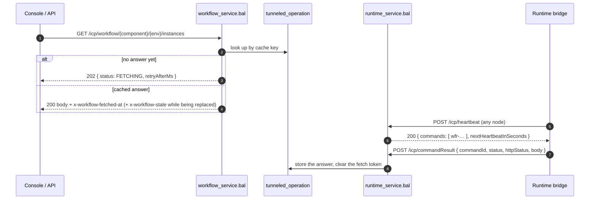

# Workflow Management over the Heartbeat Command Tunnel

This guide explains how ICP manages workflows inside an integration runtime **without ever opening a connection to it** — how a console request becomes a command carried in a heartbeat response, and what happens when things go wrong.

It is the ICP half of the design. The runtime half lives in the bridge:
[`wso2/icp-runtime-bridge` → `docs/command-tunnel.md`](https://github.com/wso2/icp-runtime-bridge/blob/main/docs/command-tunnel.md).

---

## Why a tunnel

Workflow views are read-heavy and interactive: definitions, instances, human tasks, review activities. The obvious implementation is for ICP to call a management API on each integration — which is what the earlier callback-URL proxy did, and it works well as long as everything shares a cluster.

It stops working as soon as ICP and the integrations are separated. Each integration then needs an inbound route published to the ICP cluster, a proxy rule to carry it, and a credential to distribute and rotate — cost that grows with every integration added.

The heartbeat already crosses that boundary in the direction operators allow: **the runtime dials ICP**. The tunnel reuses it. A command is queued here, delivered inside the runtime's next heartbeat *response*, executed in-process by the integration, and answered on a second outbound call. Nothing listens on the integration; no route, port, or credential has to exist for the control plane to reach it.

The tunnel's state lives in the **shared database**, not in any node's memory, because ICP's frontend and server are stateless by design. Any node can accept a request, and whichever node receives the runtime's next heartbeat delivers the work — usually not the node that accepted it.

> **Note on terminology.** This makes the *request flow* bidirectional, not the transport. There is no inbound dial and no duplex socket. A true duplex transport (WebSocket, gRPC streaming) is a possible later step and would keep the same outbound-only property.

---

## Nothing waits: the two flows

No HTTP request is ever held open waiting for a runtime. A read is answered from the cache, or accepted while a runtime materializes it; a mutation is queued and answered with an id the console polls. Polling is the contract, not a workaround.

**Reads** (`GET`):

**Mutations** (`POST`/`PUT`/`DELETE`):

1. The request is written to `tunneled_operation` (`cacheable = false`) and answered **202 `{operationId}`** immediately.
2. The target runtime's next heartbeat response carries it (mutations are claimed **before** reads — a user waiting on an action outranks a list refresh; at most `WF_MAX_OPERATIONS_PER_HEARTBEAT` (10) mutations and `WF_MAX_READS_PER_HEARTBEAT` (10) reads per beat).
3. The console polls `GET …/operations/{operationId}`: **202** `{status: PENDING|DELIVERED, retryAfterMs}` while in flight, then the stored `httpStatus` and body once the runtime confirmed it, or **504** `{status: EXPIRED}` when no runtime ever did.
4. A completed operation's row is kept for `WF_COMPLETED_RETENTION_SECONDS` (300s) so the poll can still collect it, then swept.

---

## Selecting a runtime

`selectWorkflowCommandTarget` picks the freshest `RUNNING` runtime for the component and environment whose stored metadata advertises the **`workflowCommands`** capability.

- A runtime advertises that capability only while a workflow integration is registered *and* its bridge has `enableWorkflowManagement = true`. The integration, not the control plane, decides whether it may be managed.
- When no runtime qualifies **and nothing is cached**, the request answers **503**. A view that has answered before keeps serving its last answer (marked stale) while the integration is away — an old list still tells the user something true, and the staleness header says so.
- Requests whose path falls outside the operation vocabulary — including the deprecated `/retry-tasks` aliases — answer **404**. They used to reach the runtime through the callback-URL proxy; that proxy is gone, and `runtimes.callback_url` is no longer written (the column stays for schema compatibility).
- Listings that are namespace-wide at the runtime (`instances.list`, `humanTasks.list`, `humanTasks.pendingCount`, `reviewActivities.list`) are scoped by default to the target runtime's **published task queue**, so two integrations sharing a Temporal namespace do not see each other's instances. A caller-supplied `taskQueue` wins.

---

## Freshness: stale-while-revalidate

Every cached answer carries a TTL chosen by what can change underneath it, and an expired answer is still served — **marked stale** — while exactly one refresh runs behind it:

| Answer | TTL |
|---|---|
| Work lists, instance lists, running instances | `15s` |
| Terminal (completed/failed) instances | `86400s` — history does not change |
| Anything, while its scope is settling after a mutation | `4s` (`WF_TTL_SETTLING_SECONDS`, applied while the scope is boosted) |
| A failed read | `15s` — served until expiry so the caller learns promptly, then retried rather than re-served |

- Responses carry `x-workflow-fetched-at` (epoch seconds) always, and `x-workflow-stale: true` when the answer is expired **or** a replacement is currently being fetched. An answer being replaced is stale by definition, whatever its clock says.
- The cache key is `sha256(scope | operation | canonical params | sorted roles)` — two users with the same roles share one entry and one fetch; different role sets never share, because the runtime's answer is role-filtered.
- Refreshes **coalesce**: claiming one is a conditional update on the row's fetch token, so twelve viewers of an expired entry produce one command, and everyone is served the current copy meanwhile. Delivered command ids carry the claiming attempt's token, so only the attempt the row currently owns can write its answer — a superseded attempt's late result is discarded.
- `?refresh=true` expires the entry and drops into the same path: the current answer still comes back immediately, marked stale, while the forced refresh runs — twenty people pressing Refresh together still produce one fetch.
- A completed mutation **stales the whole `component:environment` scope** — every operation, every role set — because a completed task changes what every role sees. Staled entries keep serving (marked stale) and refresh on next read.
- A read nobody answers within `WF_READ_FETCH_DEADLINE_SECONDS` (60s) is recorded as a failure and served as such until it expires; an answer older than `WF_STALE_SERVE_SECONDS` (1800s) past its expiry is no longer served at all and the view returns to `FETCHING`.

---

## One decision per task

Mutations carry an `x-idempotency-key` header (bounded to 64 chars of `[A-Za-z0-9._:-]`) that becomes the operation id, so a double-clicked button or a browser retry collapses onto one operation instead of acting twice.

Decisions on a human task or review (`humanTasks.complete`, `humanTasks.fail`, `reviewActivities.decide`) are the exception: their operation id derives from the **task**, `sha256(scope|decision|taskId)`, not from the caller's key. Two users deciding the same task collide on the primary key; only the first decision is ever delivered, and the loser is told **409** with the owner — WS-HumanTask's *actual owner* model without a claim step. Each refusal is also recorded as a `workflow_decision_conflict` event in `system_events`. A first attempt that ended `FAILED` or `EXPIRED` does not block the next caller: the task is still open, so a fresh attempt is queued under a derived id.

---

## Deadlines and sweeps

| | |
|---|---|
| Read fetch deadline | `WF_READ_FETCH_DEADLINE_SECONDS` = 60s — past it, the fetch is abandoned and the failure recorded |
| Mutation deadline | `WF_OPERATION_DEADLINE_SECONDS` = 1800s — generous on purpose: nothing is held open, and a user's action surviving a restart of the integration is worth more than failing it quickly |
| Expired mutation | Becomes `EXPIRED`: the poll answers **504**, and a `workflow_operation_unconfirmed` event (ERROR) is raised — it may or may not have run on the runtime, and *nobody established which*, so an operator is told rather than the record silently vanishing |
| Failed mutation | A runtime-reported failure raises `workflow_operation_failed` (WARN) |
| Sweep | `sweepWorkflowTunnelState` runs on a timer on **every** node; every statement is idempotent, so two nodes sweeping is harmless and needs no leader election |

---

## Cadence: the boost ramp

Latency is bounded by heartbeat cadence, so ICP asks a runtime to beat faster while someone is working with it, then lets it settle:

| Boost remaining | Cadence asked (`nextHeartbeatInSeconds`) |
|---|---|
| 25–30s | 1s |
| 20–25s | 2s |
| 10–20s | 5s |
| 0–10s | 10s |
| expired | no hint — the runtime's own interval |

Every workflow request extends the scope's boost window (`WORKFLOW_BOOST_WINDOW_SECONDS` = 30s), so an active session keeps the fastest cadence. A flat 1s window was the first design and cost too much: an integration serving ordinary traffic kept heartbeating every second long after the last workflow view was closed. The bridge ignores a hint that is not shorter than its own interval, so the last step is a no-op for a runtime already on 10s. The boost timestamp is written at most once per half-window (`extendWhenBelow`), so reads do not hammer the row inside the heartbeat transaction.

Practical consequences:

- The **first** request after an idle period waits up to one full heartbeat interval (default 10s) for its answer to materialize — a faster cadence can only take effect on the *next* beat. The console shows `FETCHING` meanwhile, and every visit after that is answered from the cache.
- A burst drains quickly: after executing a command the bridge heartbeats again immediately.

---

## Security model

- **Transport**: `POST /icp/commandResult` uses the same `kid`-based JWT validation as the heartbeat endpoints, and answers **202** for any authenticated post — a late or superseded result is a normal no-op, not something the bridge should retry.
- **Correlation**: a command records the runtime it was issued to, and a result is accepted only from that runtime; one from any other is refused and logged. Read results are additionally fenced by the fetch token embedded in the command id. Every runtime agent in an organization authenticates the same way, so the `commandId` alone must not be enough to answer a command queued for a different runtime.
- **Identity**: the console caller's identity and roles travel in the command's request document and are enforced by the runtime's own management API. ICP does not decide what the operation may do; it says who is asking.
- **Capability gating**: `WORKFLOW_MGMT` is only ever queued for runtimes that advertised `workflowCommands`.

---

## Workflow metadata

Definitions need no command at all. Each **full** heartbeat carries the integration's workflow descriptor — definitions, human tasks, activities, agents, with JSON schemas — alongside the runtime's advertised capabilities and its workflow worker's **task queue**. All three are consumed together: target selection needs "has workflows" *and* "accepts commands", and default listing scope needs the queue.

- Storage is delete-then-insert per runtime in `bi_workflow_metadata`; a runtime without workflows simply has no row.
- The Workflows views render from that stored metadata, so a definitions list costs no request into the runtime.
- A component whose heartbeat carries workflow metadata is **promoted** to a workflow integration on its first full heartbeat. A component auto-created from a heartbeat otherwise takes the generic `service` display type, and the integration-level Workflows view keys on `ballerinaWorkflow` — so an auto-registered integration would show no workflow features. A deliberately chosen type is left alone.

> **Schema changes need the bundled database updated too.** The repository ships a pre-built H2 database that `assembleICP` copies into the distribution, and the server never runs the init scripts against it. Adding a table to `h2_init.sql` alone leaves a fresh pack broken — heartbeat processing writes `bi_workflow_metadata` unconditionally, so a missing table fails every full heartbeat. Regenerate the bundled database (`./gradlew -p icp_server initH2Database` after deleting `icp_server/database/icp_db.mv.db`) and commit it.

---

## State and limits

All tunnel state lives in **one generic database table**, `tunneled_operation`, shared by every ICP node. A read and a mutation are the same thing to it — an operation run on a runtime whose result is stored and polled for — so they share one row shape, one claim, one completion and one sweep. `cacheable` is the distinction:

- a **read** (`cacheable = true`) — one row per distinct read (key = the sha256 above): the stored request, the latest answer, its expiry, and the in-flight fetch token. Coalesced onto its key and re-served while stale.
- a **mutation** (`cacheable = false`) — one row per mutation: the request document, target runtime, status (`PENDING` → `DELIVERED` → `COMPLETED`/`FAILED`/`EXPIRED`), and the result. Addressed to one runtime, delivered once.

The table is generic on purpose: a `kind` column (`workflow.read`, `workflow.operation`) says what a row is about, so another feature adds a kind rather than a table, and no migration is owed when one does. `expires_at` is the current phase's deadline for both — a read's staleness horizon, a mutation's delivery deadline. Timestamps are epoch-second `BIGINT`s — one representation across all five database engines. There are **no foreign keys** to `runtimes` or `users`: K8s deletes runtime rows on scale-down, and a CASCADE would erase the record of a mutation whose outcome nobody established.

An ICP restart loses nothing: rows survive, an in-flight mutation is still delivered on the next heartbeat any node receives, and read fetches that die with the node are abandoned by the sweep and retried on the next request.

---

## Adding an operation

The vocabulary is shared with the runtime's management API, so both sides must know a new operation:

1. Map the path and method in `mapWorkflowRequestToOperation` (`icp_server/workflow_tunnel.bal`) to its dot-qualified name — `instances.start`, `humanTasks.complete`, and so on.
2. Add any parameters the operation needs to the `params` map, keyed exactly as the management API expects them.
3. For a read, pick its TTL in `workflowReadTtlSeconds` — the default is the list TTL. If its answer is namespace-wide at the runtime, add it to `WF_TASK_QUEUE_SCOPED_OPERATIONS` so it is scoped to the target's queue.
4. Confirm the runtime's `workflow.management` module implements that operation name; an unknown name is rejected at the runtime, not here.

Queueing, delivery, correlation, deadlines, and result relay are operation-agnostic.

---

## Where the code is

| File | Responsibility |
|---|---|
| `icp_server/workflow_service.bal` | The console-facing resource: request → operation mapping, idempotency keys, operation polling, definitions from stored metadata |
| `icp_server/workflow_tunnel.bal` | Cache keys and TTLs, read/mutation flows, decision dedup, result fencing, boost ramp, target selection, sweeps |
| `icp_server/runtime_service.bal` | Heartbeat endpoints that carry commands out, and `POST /icp/commandResult` that brings results back |
| `icp_server/modules/storage/cache_repository.bal` | `tunneled_operation` access: claims, coalescing, invalidation, sweeps |
| `icp_server/modules/storage/heartbeat_repository.bal` | `bi_workflow_metadata` upsert and workflow-integration promotion |
| `icp_server/resources/db/migration-scripts/add_cache_tables_*.sql` | The `tunneled_operation` table, per engine |
| `icp_server/tests/workflow_tunnel_tests.bal` | Cache flows, fencing, decision dedup, expiry, the boost ramp, and one end-to-end round trip over real HTTP against a simulated bridge |
| `icp_server/tests/workflow_metadata_tests.bal` | Metadata upsert and clear, capability recording, promotion rules |
